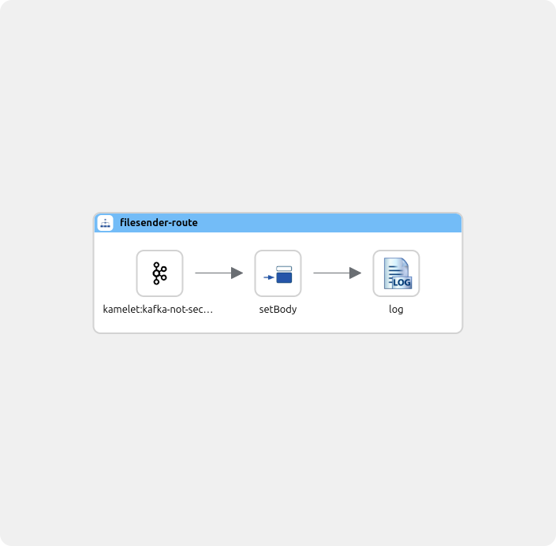

# Nextgen filesender

This route gets notifications from minio, downloads the file and sends it to destination.

## How-to run

### Local dev with jbang and camel cli

Define local properties in file local.properties. Run with

```sh
camel run --dev --properties=local.properties file-sender.camel.yaml
```

### Test on local k8s
Define properties and secrets in separate properties files. Create Secrets and ConfigMaps like so:
```
kubectl create secret generic file-sender --from-env-file local-secrets.properties

kubectl create cm file-sender --from-file local.properties
```

Run with

```sh
kamel run --dev --config=secret:file-sender --config=configmap:file-sender file-sender.camel.yaml
```

### Promote integration

While integration is running, open second terminal. Get name of running integration with:
```
kamel get
```

Then run:
```
kamel promote integration-name -n camel-k --to prod  -o yaml > integration.yaml
```

Apply the generated integration.yaml from above command or copy it to ArgoCD config repo.

Create missing ConfigMaps and Secrets etc.


## Route


